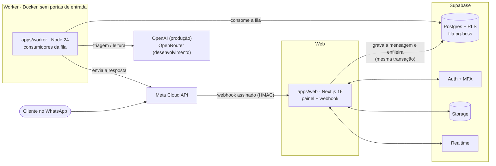

# Atendimento IA para restaurantes

Atendimento ao cliente de um restaurante com várias unidades, feito **100% por IA no WhatsApp oficial**. Quando o caso pede uma pessoa, a conversa passa para a equipe. Um painel web serve ao dono, ao gerente e ao atendente para acompanhar as conversas, manter o conteúdo e controlar os gastos.

> Projeto privado da Harmony Digital. A especificação técnica completa está no [PRD.md](PRD.md); o histórico de construção, no [PLAN.md](PLAN.md).

## Sumário

- [Objetivo](#objetivo)
- [O que o sistema faz](#o-que-o-sistema-faz)
- [Arquitetura](#arquitetura)
- [Stack](#stack)
- [Estrutura do repositório](#estrutura-do-repositório)
- [Princípios de engenharia](#princípios-de-engenharia)
- [Como rodar localmente](#como-rodar-localmente)
- [Testes e qualidade](#testes-e-qualidade)
- [Banco de dados e migrations](#banco-de-dados-e-migrations)
- [Segurança e LGPD](#segurança-e-lgpd)
- [Documentação](#documentação)
- [Convenções de contribuição](#convenções-de-contribuição)

## Objetivo

Responder na hora, a qualquer momento, às perguntas que mais ocupam a equipe de um restaurante, sempre com **dados aprovados pelo próprio restaurante**:

- Reduzir a carga da equipe no WhatsApp sem perder o toque humano. A IA resolve o que é rotina, e a equipe assume quando o cliente pede ou se frustra.
- Nunca inventar. Preço, horário, endereço e disponibilidade vêm só do banco, nunca do "conhecimento geral" do modelo.
- Gasto previsível. Cada chamada paga de IA ou de WhatsApp passa por um limite de gasto configurável.
- Privacidade desde o início: a LGPD orienta o modelo de dados, o pipeline da IA e a operação.

## O que o sistema faz

**No WhatsApp, a IA atende quatro serviços.** Qualquer coisa fora deles é barrada antes de chegar ao modelo principal.

| Serviço | O que resolve |
|---|---|
| **S1 · Horários e unidades** | Horários do dia (com feriados e exceções), "está aberto agora?", endereço e localização de cada unidade. |
| **S2 · Reservas** | Registra quem vai a qual unidade, em que dia e horário, e com quantas pessoas. Pede o nome e o contato e respeita a **lotação diária** de cada unidade; quando lota, oferece outra unidade, outro dia ou um grupo menor. O cliente pode mudar ou cancelar a reserva pela conversa. |
| **S3 · Eventos** | Coleta o pedido de evento (tipo, data, convidados, espaço) e o coloca na fila da equipe. |
| **S4 · Cardápio** | Responde preços e itens a partir do cardápio cadastrado e envia o arquivo do cardápio. |

**Atendimento humano.** O cliente pode pedir uma pessoa, e a IA também passa a conversa quando detecta frustração. A equipe atende numa inbox em tempo real, com respostas rápidas, e pode devolver a conversa à IA.

**Painel web**, adaptado ao computador e ao celular:

- **Início**, a central da operação: fila aguardando atendimento, agenda do dia e alertas.
- **Conversas**, com a lista e a conversa abertas lado a lado.
- **Agenda**, com reservas e pedidos de evento por dia, ocupação de cada unidade e status (confirmada, cancelada, não veio).
- **Conteúdo**: cardápio, informações e mensagens, com **importação por IA** de PDF, fotos e CSV. Nada importado vira dado oficial sem revisão humana.
- **Unidades**: dados, horários, exceções, espaços e lotação máxima.
- **Gestão**: gastos e limites de IA e WhatsApp, equipe (convites e papéis), privacidade (LGPD) e ajustes, como regras da reserva, logo do restaurante e modo demonstração.
- **Simulador** de conversa, que usa o pipeline real com um limite de gasto próprio, e **busca rápida** com `Ctrl/Cmd + K`.

**Papéis:** dono, gerente (com acesso a todas as unidades ou só a algumas) e atendente. As permissões são aplicadas no servidor e no banco (RLS), não só na tela.

## Arquitetura



**Fluxo de uma mensagem:**

1. **Recebimento (web).** O webhook valida a assinatura HMAC sobre o corpo bruto e, numa única transação, grava a mensagem (sem duplicar) e enfileira o processamento. Ele responde em menos de 500 ms, sem chamar IA nem a Meta durante a requisição.
2. **Processamento (worker).** A fila serializa cada conversa e agrupa rajadas de mensagens. Para cada uma, o worker:
   1. aplica o pré-filtro (saudações, pedido de humano, flood e pedidos de LGPD custam zero tokens);
   2. apaga os dados pessoais do texto;
   3. faz a **triagem** com um modelo pequeno, que só **extrai** intenção e dados em JSON validado por Zod;
   4. **reserva orçamento** atomicamente antes de qualquer chamada paga;
   5. deixa o **domínio** em `packages/core` decidir a resposta a partir dos dados aprovados e de textos-modelo editáveis.
3. **Envio e registro.** A resposta sai pela Meta, e o custo real, a auditoria e as ações (reserva, pedido de evento) são gravados na mesma transação.

O LLM **não executa ações livremente**: ele extrai, e o código decide, valida e grava. Os prompts são versionados e nunca editados depois de publicados.

## Stack

| Camada | Tecnologia |
|---|---|
| Linguagem | TypeScript 6 (strict) em todo o código |
| Monorepo | pnpm 11 workspaces + Turborepo |
| Web e painel | Next.js 16 (App Router, Server Actions), React 19, Tailwind CSS v4, shadcn/ui (Radix), React Hook Form |
| Worker | Node.js 24 em Docker, pino para logs JSON, pdf-lib para PDF |
| Banco | Supabase Postgres, Drizzle ORM + drizzle-kit, RLS em todas as tabelas |
| Fila e agendamento | pg-boss 12, no próprio Postgres |
| Autenticação | Supabase Auth com MFA (TOTP) para dono e gerente |
| Arquivos e tempo real | Supabase Storage (buckets privados com RLS) e Realtime (broadcast privado) |
| IA | OpenAI direto em produção e OpenRouter no desenvolvimento, com clientes `fetch` próprios atrás da mesma interface, escolhidos por `AI_PROVIDER` |
| WhatsApp | Meta Cloud API, com cliente próprio e verificação HMAC |
| Validação | Zod 4 para env, webhook, Server Actions e saída do LLM |
| Observabilidade | Sentry (web e worker) com dados pessoais removidos |
| Testes | Vitest (unidade, UI e banco), Playwright (e2e celular e desktop), evals de IA |

## Estrutura do repositório

```
.
├── apps/
│   ├── web/            Next.js: painel, webhook do WhatsApp, página pública de privacidade, e2e (Playwright)
│   └── worker/         Node: consumidores pg-boss (conversa, envio, importação, convites, retenção), Dockerfile
├── packages/
│   ├── core/           domínio puro (S1–S4, pré-filtro, orçamento, redação de PII) — sem I/O
│   ├── db/             schema Drizzle, migrations (inclui RLS e funções SQL), DAL, scripts de bootstrap
│   ├── ai/             clientes de LLM, prompts versionados, schemas de saída e evals
│   ├── whatsapp/       cliente da Cloud API, verificação HMAC e schemas do webhook
│   └── config/         schema de variáveis de ambiente (Zod, validado no boot)
├── supabase/           configuração do Supabase CLI para o ambiente local
├── infra/              preparação do servidor do worker
└── docs/               specs, planos, roteiros de homologação, runbooks e histórico
```

## Princípios de engenharia

A lista completa de invariantes está no [PRD §10](PRD.md#10-invariantes-nunca-violar). Os principais:

- **Escopo fechado da IA:** só os quatro serviços. O que está fora de escopo é barrado no pré-filtro ou na triagem.
- **Grounding:** fatos vêm apenas do banco, de dado aprovado.
- **Saída do LLM sempre validada** com Zod. O modelo não tem ações livres.
- **Orçamento atômico:** nenhuma chamada paga sem reserva de saldo bem-sucedida.
- **Defesa em profundidade:** RLS em toda tabela, e toda Server Action confere sessão, papel e unidade na camada de acesso a dados (DAL), sem confiar só no middleware. O `set_config` é sempre parametrizado.
- **Domínio puro e testável:** `packages/core` recebe as dependências por parâmetro.
- **TDD e evidência:** teste que falha antes da implementação, inclusive para o caso ruim (sem permissão, entrada inválida, concorrência).
- **Dados:** dinheiro em centavos (`integer`) ou `numeric`, datas em `timestamptz`, e consultas do caminho quente com índice e `EXPLAIN` revisado.

## Como rodar localmente

### Pré-requisitos

- Node.js **24** ou superior e **pnpm 11** (`corepack enable`)
- Docker, usado pelo Supabase local
- Uma chave do [OpenRouter](https://openrouter.ai), para que a IA responda no simulador

### 1. Instalar e configurar

```bash
pnpm install
cp .env.example .env    # preencha os valores; o arquivo descreve cada variável
pnpm db:start           # sobe o Supabase local (Postgres, Auth, Storage, Realtime)
pnpm db:migrate         # aplica as migrations
```

As variáveis são validadas por Zod no boot. Se faltar alguma, a aplicação para com a lista do que está ausente. A `SUPABASE_SERVICE_ROLE_KEY` local **não vai para o `.env`**: exporte-a só no terminal, a partir de `supabase status`.

```bash
export SUPABASE_SERVICE_ROLE_KEY=$(pnpm exec supabase status -o env | grep '^SERVICE_ROLE_KEY=' | cut -d= -f2- | tr -d '"')
```

### 2. Criar o restaurante e o dono

```bash
pnpm --filter @atd/db bootstrap --restaurante "Restaurante Demo" --dono dono@restaurante.local --nome-dono "Dono"
pnpm --filter @atd/db demo:s1   # opcional: unidades e horários de exemplo
```

O convite do dono chega no Mailpit local (http://127.0.0.1:54324).

### 3. Subir o painel e o worker

Rode em dois terminais, cada um com o `.env` carregado:

```bash
# terminal 1 — painel em http://localhost:3000
cd apps/web && set -a && source ../../.env && set +a && pnpm dev

# terminal 2 — worker (com a SUPABASE_SERVICE_ROLE_KEY exportada neste terminal)
pnpm --filter @atd/worker dev
```

O WhatsApp não é necessário no desenvolvimento: use o **Simulador** do painel, que passa pelo mesmo pipeline do worker. Para os dados do simulador aparecerem em Início, Agenda e Conversas, ligue o **modo demonstração** em Gestão → Ajustes.

## Testes e qualidade

```bash
pnpm check        # lint + typecheck + testes + build: o portão antes de qualquer entrega
pnpm test:unit    # domínio e utilitários
pnpm test:ui      # componentes React (Testing Library)
pnpm test:db      # banco real: RLS, concorrência, funções SQL (cada processo usa um banco atd_test_N clonado)
```

**E2E (Playwright)**, com os projetos `celular` e `desktop` (1440×900). O worker do teste usa um LLM falso:

```bash
cd apps/web && set -a && source ../../.env && set +a && pnpm exec playwright test
# para rodar ao lado de outro servidor: E2E_PORT=3001 pnpm exec playwright test
```

**Evals de IA**, em `packages/ai/evals`:

- **Camada 2:** determinista, roda junto com o `pnpm test` e cobre extração e composição das respostas.
- **Camada 1:** usa o modelo real e precisa de chave. Comandos: `pnpm --filter @atd/ai eval:s1` (também `eval:s2`, `eval:s3`, `eval:s4`, `eval:frustracao` e `eval:ingestao`).
- **Produção:** antes de publicar, rode `smoke:ia:prod` e `eval:prod` com a chave da OpenAI.

## Banco de dados e migrations

- O schema fica em `packages/db/src/schema`. As migrations são geradas **somente pelo drizzle-kit**: `pnpm --filter @atd/db generate` para tabelas e `generate:custom` para RLS, funções, grants e Storage. Elas ficam em `packages/db/migrations`.
- **Nunca edite uma migration já aplicada.** Crie outra.
- O painel acessa o banco com o contexto RLS do usuário. O worker usa o papel `worker_app`, com grants mínimos, nunca `service_role`.

## Segurança e LGPD

- **Dados pessoais longe da IA e dos logs:** nome, telefone, CPF e outros dados pessoais são redigidos antes do LLM. Logs e Sentry passam por limpeza.
- **Telefones cifrados** no banco. Ver um telefone no painel é uma ação auditada.
- **Provedores de IA:** OpenAI com `store: false` em produção; OpenRouter com `data_collection: 'deny'` e `zdr: true` no desenvolvimento.
- **Retenção e anonimização** automáticas (diárias, pelo worker), com exportação e exclusão de dados do titular pelo painel.
- **Áudio** descartado após a transcrição. **Dado de saúde** nunca vai para campo estruturado.
- **Webhook** aceito só com HMAC válido. **MFA** obrigatório para dono e gerente. A `service_role` e os segredos nunca vão para o browser.
- **Segredos** só em variáveis de ambiente: arquivos `.env*` nunca são commitados.

## Documentação

| Documento | Conteúdo |
|---|---|
| [PRD.md](PRD.md) | Especificação técnica: arquitetura, modelo de dados, pipeline da IA, custos, LGPD, segurança e **invariantes** |
| [PLAN.md](PLAN.md) | Etapas de construção, checklists e evidências |
| [CLAUDE.md](CLAUDE.md) / [AGENTS.md](AGENTS.md) | Guia para agentes de código (cópias idênticas) |
| [docs/specs](docs/specs) | Especificações de cada entrega |
| [docs/plans](docs/plans) | Planos de implementação |
| [docs/homologacao](docs/homologacao) | Roteiros de homologação com o dono |
| [docs/runbooks](docs/runbooks) | Operação: deploy, publicação e incidentes |

## Convenções de contribuição

- **Idioma:** identificadores em inglês. UI, mensagens ao cliente, docs e commits em **português do Brasil**.
- **Fluxo:** branch a partir da `main`, PR para a `main` e homologação do dono antes do merge.
- **Commits** pequenos, no imperativo ("Adiciona…", "Corrige…").
- **Antes do PR:** `pnpm check` verde e e2e verde. Se a mudança tocar em `packages/ai`, rode também os evals.
- **Bibliotecas:** consulte a documentação atual antes de usar uma API, sem confiar na memória.
